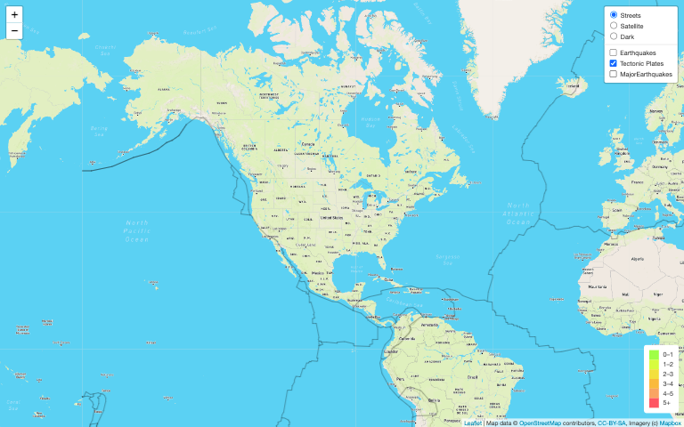
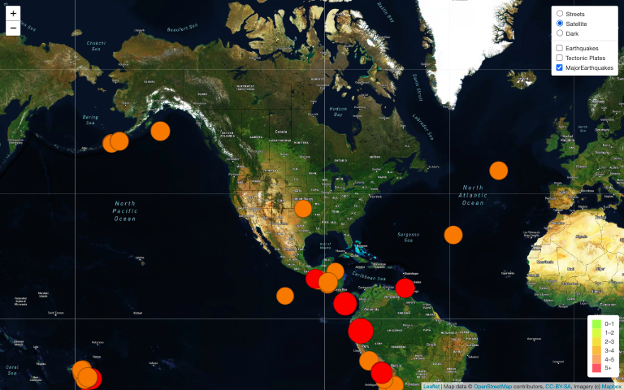
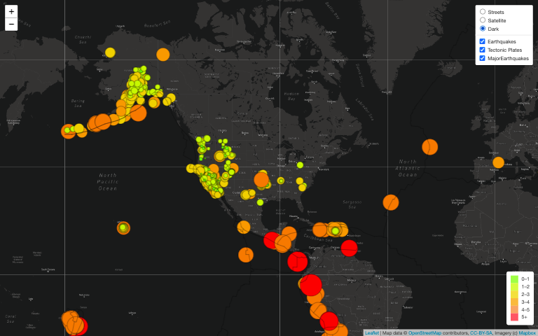

# Mapping Earthquakes

The purpose of this project is to visually show the differences between the magnitudes of earthquakes all over the world for the last seven days.

Your approach will be to use the JavaScript and the D3.js library to retrieve the coordinates and magnitudes of the earthquakes from the GeoJSON data. You'll use the Leaflet library to plot the data on a Mapbox map through an API request and create interactivity for the earthquake data.

To complete this project, use a URL for GeoJSON earthquake data from the USGS website and retrieve geographical coordinates and the magnitudes of earthquakes for the last seven days. Then add the data to a map.

Before you add your folders and files to the Mapping_Earthquakes folder, Basil would like you to create a GitHub branch for the basic map. Basil informs you that creating a branch off the main branch allows you to create a new feature, or change some part of the original code. Once he has reviewed your code on your branch, Sadhana will show you how to merge it with the main branch.

Mapbox provides custom maps for websites and applications such as Strava, Facebook, the Financial Times, The Weather Channel, Snapchat, and Instacart. Since October 2019, Mapbox has been generating up to 14 billion individual sensor readings daily across 100,000 map updates on connected devices.

## Background

## Overview of Project

Basil and Sadhana like how you created your earthquake map with two different maps and the earthquake overlay. Now, Basil and Sadhana would like to see the earthquake data in relation to the tectonic plates’ location on the earth, and they would like to see all the earthquakes with a magnitude greater than 4.5 on the map, and they would like to see the data on a third map.

### Purpose

- Deliverable 1: Add Tectonic Plate Data
- Deliverable 2: Add Major Earthquake Data
- Deliverable 3: Add an Additional Map

## Analysis And Challenges

## Methodology: Analytics Paradigm

#### 1. Decomposing the Ask
Create a map with GeoJSON earthquake data from the USGS website. The required datas are stated in [Purpose](#purpose)

#### 2. Identify the Datasource
GeoJSON files from:
* Past 7 days - All Earthquakes (https://earthquake.usgs.gov/earthquakes/feed/v1.0/summary/all_week.geojson)
* Past 7 days - M4.5+ Earthquakes (https://earthquake.usgs.gov/earthquakes/feed/v1.0/summary/4.5_week.geojson)
* Tectonic Plates (https://raw.githubusercontent.com/fraxen/tectonicplates/master/GeoJSON/PB2002_boundaries.json)

### 3. Define Strategy & Metrics
**Resource:** Javascript, CSS, HTML, Data-Driven Documents (D3) library, Leaflets.js, API, GeoJSON,

#### 4. Data Retrieval Plan
d3.json call

#### 5. Assemble & Clean the Data
Not required

#### 6. Analyse for Trends
Not required

#### 7. Acknowledging Limitations
This can be expanded to also study trends but currently it's only used as visualisation.

#### 8. Making the Call:
The "Proper" Conclusion is indicated below on [Summary](#summary)

## Analysis

The final code checkin is available in this directory: https://github.com/suyinwb/Mapping_Earthquakes/tree/main/%20Earthquakes_Challenge

>Deliverable 1: Tectonic Plate




>Deliverable 2: Major Earthquake



>Deliverable 3: Dark Mode



## Summary
Making too much changes and branches can cause conflict when merging in github. So it's best to sequentially merge the branches to be able to resolve conflicts accurately without overwriting major code changes.

## Appendix

Leaflet Quickstart Guide: https://leafletjs.com/examples/quick-start/

Changing the map's style

```
mapbox/streets-v11
mapbox/outdoors-v11
mapbox/light-v10
mapbox/dark-v10
mapbox/satellite-v9
mapbox/satellite-streets-v11
```

Setup push to branch with the command below and later work as usual in this branch
```
git push --set-upstream origin Simple_Leaflet_Map
```
